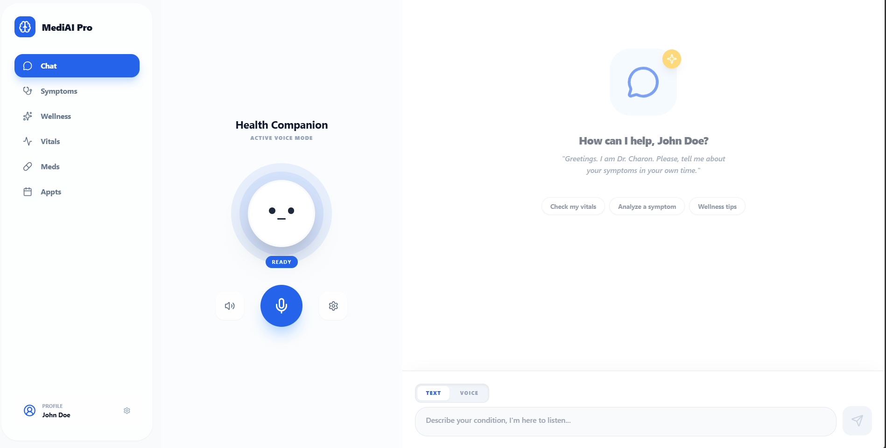
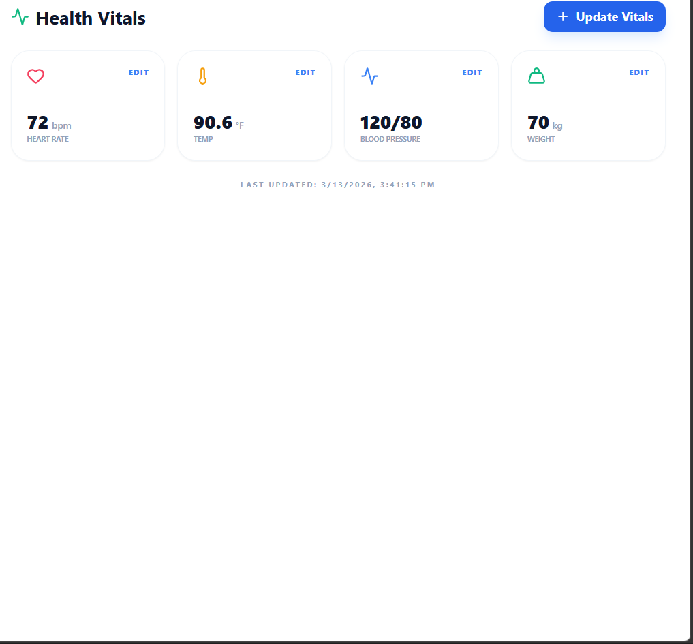

# medi-ai-healthcare-assistant
AI-powered health assistant with voice interaction, symptom analysis, vitals tracking, medications management, and hospital search using React.
# 🖼 Project Demo

# 🧠 MediAI Pro – AI Health Assistant

MediAI Pro is an **AI-powered health assistant web application** that combines **voice interaction, health tracking, and AI medical guidance** into a single smart dashboard.

The application uses **Google Gemini AI**, real-time **voice communication**, and **health monitoring tools** to provide an interactive healthcare companion.

# 🚀 Features

### 🎙 AI Voice Assistant
- Real-time voice conversation with AI
- Multiple AI personalities:
  - Man
  - Woman
  - Boy
  - Girl
  - Old Doctor
- Natural speech synthesis and audio responses
 ### Interface

### 💬 AI Chat Assistant
- Text-based medical assistant
- Personalized responses based on:
  - User profile
  - Vitals
  - Medications
### Patient Profile

### ❤️ Health Monitoring
Track personal health metrics:

- Heart Rate
- Body Temperature
- Blood Pressure
- Weight

All vitals are saved locally and can be updated anytime.
 ### Vitals

---

### 💊 Medication Manager

Add and manage medications:

- Medicine name
- Dosage
- Frequency
- Start date
 ### wellness

---

### 📅 Appointment Manager

Schedule and manage doctor appointments:

- Doctor name
- Specialty
- Date and time
- Reason for visit
 ### Appoinments

---

### 🩺 AI Symptom Checker

Describe symptoms and get AI analysis including:

- Possible causes
- Self-care advice
- Urgency level
- When to see a doctor
 ### Systom analysis

---

### 🌟 Wellness Tips

Get personalized health advice such as:

- Sleep tips
- Nutrition recommendations
- Exercise guidance
- Stress management

---

### 📍 Nearby Hospital Finder

Using geolocation, the app can:

- Search nearby hospitals
- Show map links
- Provide location-based recommendations

---

# 🧩 Tech Stack

### Frontend
- React
- TypeScript
- Tailwind CSS
- Lucide Icons

### AI Integration
- Google Gemini API
- GoogleGenAI SDK

### Audio Processing
- Web Audio API
- Speech Recognition API
- Real-time AI audio streaming

### Storage
- LocalStorage for health data persistence

---

# 📂 Project Structure

medi-ai-pro
│
├── src
│ ├── App.tsx
│ │
│ ├── components
│ │ └── FaceAvatar.tsx
│ │
│ ├── services
│ │ ├── geminiService.ts
│ │ └── audioUtils.ts
│ │
│ └── types.ts
│
├── public
│
├── .env.example
├── package.json
└── README.md

---

# ⚠️ Disclaimer

MediAI Pro is designed for **educational and demonstration purposes only**.

It does **not replace professional medical advice, diagnosis, or treatment**.  
Always consult a licensed healthcare professional for medical concerns.

# ⭐ Support

If you like this project, please consider **starring the repository** ⭐ on GitHub.

